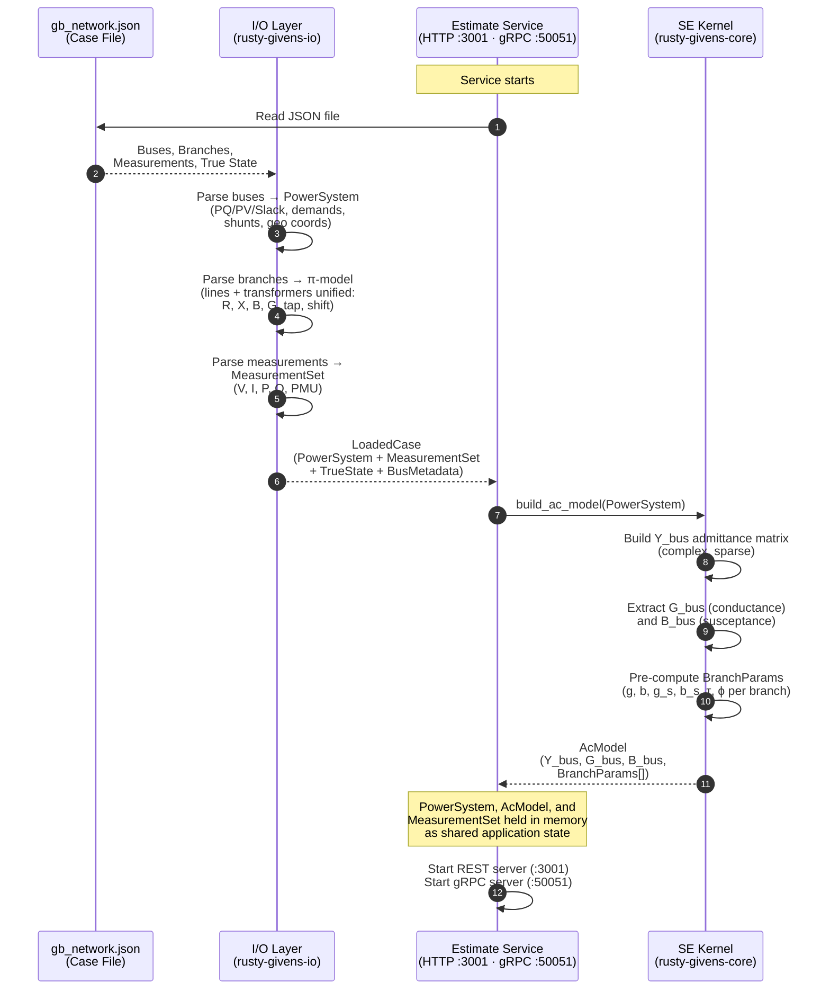

# Estimate Service — Internal Sequence Diagram

## Startup (once, on service boot)

## Run Estimation (on each request)

```mermaid
sequenceDiagram
    autonumber
    participant FE as Angular Frontend
    participant API as REST API Handler<br/>(POST /api/estimate)
    participant EX as execute_estimation()
    participant WLS as WLS Solver<br/>(Gauss-Newton loop)
    participant JAC as Jacobian Evaluator<br/>(measurement functions)
    participant GAIN as Gain Matrix Assembly<br/>(G = Hᵀ W H)
    participant FACT as Linear Solver<br/>(Cholesky / LU)
    participant POST as Post-Estimation<br/>(dependent results)

    FE->>API: POST /api/estimate<br/>{ factorization: "SparseCholesky",<br/>  formulation: "NormalEquations",<br/>  tolerance: 1e-4,<br/>  max_iterations: 50 }
    API->>API: Parse formulation +<br/>factorization from request
    API->>EX: execute_estimation<br/>(PowerSystem, AcModel,<br/>MeasurementSet, config)

    Note over EX: Start SE timer

    EX->>WLS: WlsSolver.estimate()

    Note over WLS: ━━━ Initialise State Vector ━━━<br/>x⁰ = [θ₁⁰…θₙ⁰, V₁⁰…Vₙ⁰]<br/>Flat start: V = 1.0 p.u., θ = 0°

    rect rgb(44, 62, 80)
        Note over WLS,FACT: ━━━━ Gauss-Newton Iteration Loop (ν = 0, 1, 2, …) ━━━━
        WLS->>JAC: evaluate(θ, V)

        Note over JAC: Compute h(x) and Jacobian H(x)<br/>for every active measurement:

        JAC->>JAC: Voltmeters: h = Vᵢ<br/>∂h/∂Vᵢ = 1

        JAC->>JAC: Wattmeters (bus injection):<br/>h = Vᵢ Σⱼ(Gᵢⱼ cos θᵢⱼ + Bᵢⱼ sin θᵢⱼ)Vⱼ<br/>Jacobian: ∂Pᵢ/∂θⱼ, ∂Pᵢ/∂Vⱼ from Y_bus

        JAC->>JAC: Wattmeters (branch flow):<br/>h = Pᵢⱼ(x) from π-model<br/>Jacobian: ∂Pᵢⱼ/∂θᵢ, ∂Pᵢⱼ/∂Vᵢ, etc.

        JAC->>JAC: Varmeters (bus + branch):<br/>h = Qᵢ(x), Qᵢⱼ(x)

        JAC->>JAC: Ammeters:<br/>h = |Iᵢⱼ| from π-model

        JAC->>JAC: PMUs (bus voltage / branch current):<br/>Polar or Rectangular coordinates<br/>with optional correlation

        JAC-->>WLS: h(x), H(x) [sparse], z, W

        WLS->>WLS: Residual: r = z − h(x)

        WLS->>GAIN: Assemble gain matrix<br/>G = Hᵀ W H   (sparse CSC)
        GAIN->>GAIN: Build sparsity pattern<br/>(first iteration only — cached)
        GAIN->>GAIN: Fill numerical values<br/>G[a,b] += Σₖ Hₖₐ Wₖ Hₖb
        GAIN->>GAIN: RHS: Hᵀ W r
        GAIN->>GAIN: Slack constraint:<br/>G[slack, :] = 0, G[:, slack] = 0<br/>G[slack, slack] = 1, rhs[slack] = 0
        GAIN-->>WLS: G, rhs

        WLS->>FACT: Solve G Δx = rhs
        alt Sparse Cholesky (LLT)
            FACT->>FACT: Symbolic factorization<br/>(first iter only — pattern cached)
            FACT->>FACT: Numeric Cholesky: G = LLᵀ
            FACT->>FACT: Forward/back substitution
        else Sparse LU
            FACT->>FACT: Symbolic factorization<br/>(first iter only)
            FACT->>FACT: Numeric LU: G = LU
            FACT->>FACT: Forward/back substitution
        else Dense Cholesky
            FACT->>FACT: Dense LLᵀ (with LU fallback)
        end
        FACT-->>WLS: Δx = [Δθ₁…Δθₙ, ΔV₁…ΔVₙ]

        WLS->>WLS: Update state:<br/>θ ← θ + Δθ<br/>V ← V + ΔV

        WLS->>WLS: Convergence check:<br/>max|Δx| < tolerance?

        Note over WLS: If not converged → next iteration<br/>If converged or max_iter → exit loop
    end

    WLS->>WLS: Capture solver artifacts:<br/>H, r, z, h(x̂), W, G

    WLS-->>EX: EstimationResult<br/>(V̂, θ̂, converged, iterations,<br/>diagnostics, artifacts)

    Note over EX: Stop SE timer

    alt Converged
        EX->>EX: Compare V̂, θ̂ with true state<br/>→ per-bus VM error, VA error<br/>→ MAE, max error

        EX->>POST: evaluate_post_estimation(V̂, θ̂)
        POST->>POST: Branch flows: Pᵢⱼ, Qᵢⱼ, Iᵢⱼ<br/>at from + to terminals
        POST->>POST: Branch losses: ΔP = Pᵢⱼ + Pⱼᵢ
        POST->>POST: Bus injections: Pᵢ, Qᵢ from Y_bus
        POST->>POST: Power balance:<br/>ΣP_gen, ΣP_load, ΣP_loss
        POST-->>EX: PostEstimationResult

        EX->>EX: build_global_status()<br/>→ per-voltage-level statistics<br/>→ measurement counts<br/>→ objective function J(x̂)
    else Not converged
        Note over EX: Skip post-estimation
    end

    EX-->>API: SeResultPayload

    API->>API: Cache result for<br/>GET /api/last-result

    API-->>FE: JSON Response<br/>{ converged, iterations,<br/>  se_time_seconds,<br/>  buses: [{est_vm, est_va_deg,<br/>           vm_error, …}],<br/>  global_status: {branch_flows,<br/>    bus_injections, power_balance} }
```

## Notation Reference

| Symbol | Meaning |
|--------|---------|
| x = [θ, V] | State vector: voltage angles (rad) + magnitudes (p.u.) |
| z | Measurement vector (telemetered values from SCADA/PMU) |
| h(x) | Measurement function — what sensors *should* read at state x |
| H(x) = ∂h/∂x | Jacobian matrix (sensitivities of measurements to state) |
| W = diag(1/σ²) | Precision (weight) matrix — inverse measurement variances |
| r = z − h(x) | Measurement residuals |
| G = Hᵀ W H | Gain matrix (weighted normal equations) |
| Δx | State update (correction) per Gauss-Newton iteration |
| V̂, θ̂ | Estimated bus voltages and angles (final SE solution) |
| Pᵢⱼ, Qᵢⱼ | Active/reactive power flow on branch i→j |
| Y_bus | Bus admittance matrix (complex, sparse) |
| G_bus, B_bus | Real / imaginary parts of Y_bus (conductance / susceptance) |
| π-model | Equivalent circuit for lines and transformers (R, X, B, tap, shift) |
| τ, ϕ | Transformer tap ratio and phase shift angle |

## Key Design Decisions

1. **Y_bus and AcModel are built once at startup** — the network topology
   does not change between estimation runs.  Only the state vector x
   changes during iteration.

2. **Sparsity pattern is cached** — the gain matrix G = Hᵀ W H has
   the same nonzero pattern every iteration (determined by topology and
   measurement placement).  The symbolic factorization (fill-reducing
   ordering) is computed once; only numerical values are refilled.

3. **Six solver formulations** share the same Jacobian evaluator —
   the measurement function h(x) and its derivatives are computed
   identically regardless of which linear algebra method is used downstream.

4. **Dual API transport** — the same `execute_estimation()` function
   is called by both the REST (JSON/HTTP) and gRPC (Protobuf/HTTP2)
   handlers, ensuring identical behaviour.

5. **Solver artifacts are retained** — the final-iteration Jacobian,
   residuals, and gain matrix are stored so that post-estimation analyses
   (Bad Data Detection, Observability, Redundancy) can run without
   re-solving.
